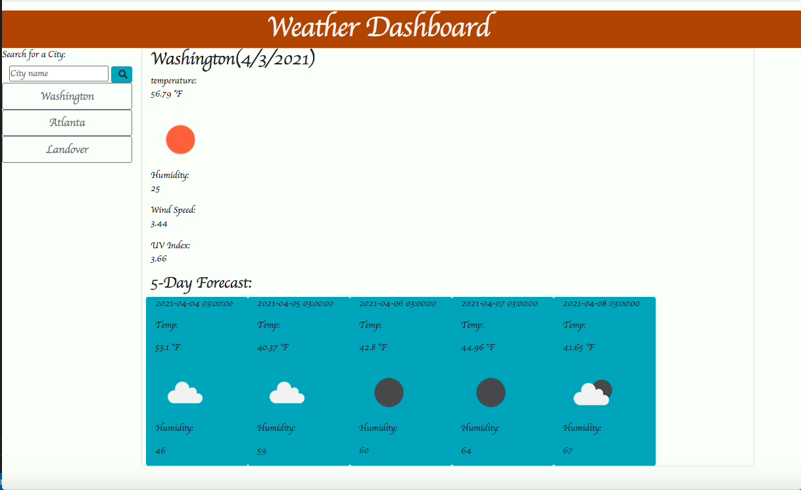

# Weather Dashboard

Weather dashboard is a nifty web application that allows a user to view the daily temperature, humidity, wind speed, and UV index based on a specific city. 

# Usage 

Users are able to search the city of their choice by using the search bar. Once they click on the magnifying glass, the current weather (temperature, humidity, wind speed, and UVI) along with the five-day forecast is displayed on the right-hand side of the screen. For future reference and to get the most updated weather information, the users' search history is stored on the left-hand side of the screen.  

# Webpage Display 

Weather Dashboard 

# Webpage Links

Application URL: https://fasicasr.github.io/weather-dashboard/index.html
Github: https://github.com/fasicasr/weather-dashboard